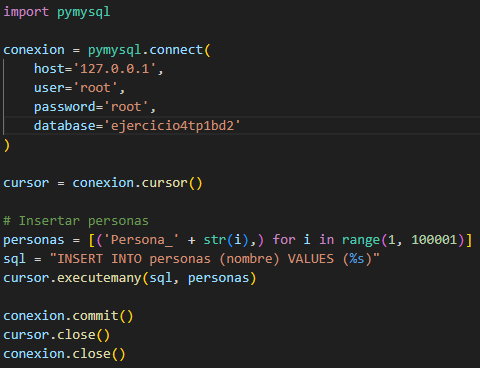

# Base de Datos II

## Tema general: Fundamentos, Integridad y Concurrencia

---

## Ejercicio 1: Reglas de Integridad

### Enunciado
Dado un modelo de base de datos de una universidad, identificar violaciones posibles a la integridad referencial si se elimina un estudiante con cursos inscritos. ¿Qué mecanismos usarías para evitarlo?

### ¿Qué pasa si eliminamos un estudiante?
Si se elimina un estudiante que aún está presente en la tabla de inscripciones, se produce una violación de la integridad referencial. Esto ocurre porque quedarían registros en la tabla **Inscripciones** que hacen referencia a un estudiante que ya no existe, generando inconsistencia en los datos.

### Tablas hipotéticas

**Tablas principales:**
- `Estudiantes` (`id_estudiante`, `nombre`, `edad`)
- `Inscripciones` (`id_estudiante`, `id_curso`, `fecha_inscripción`)

**Relación:**
- `Inscripciones.id_estudiante` es una clave foránea que referencia a `Estudiantes.id_estudiante`.

### Soluciones posibles para mantener la integridad

1. **Restricción al eliminar (ON DELETE RESTRICT):**  
   Impide eliminar al estudiante si tiene inscripciones activas. Es útil cuando se desea conservar toda la información relacionada y evitar inconsistencias.

2. **Eliminación en cascada (ON DELETE CASCADE):**  
   Permite que, al eliminar un estudiante, también se eliminen automáticamente sus inscripciones. Se utiliza cuando las inscripciones no tienen sentido sin el estudiante correspondiente.

---

## Ejercicio 4: Plan de Ejecución con y sin Índice (MySQL)

### Enunciado
Comparar el rendimiento de una consulta SQL sobre una tabla con más de 100.000 registros, primero sin índice y luego con índice. Se utiliza `EXPLAIN` para analizar el plan de ejecución.

### 1. Crear la tabla
Se crea una tabla básica con un ID autoincremental y un campo de nombre.

### 2. Insertar 100.000 registros
Se usa un código en Python para insertar 100.000 registros. A cada persona se le asigna un nombre del tipo: `Persona_(suNúmero)`.

### 3. Ejecutar la consulta sin índice
Se realiza una consulta simple sin el uso de índices.

**Tiempo de ejecución:** 0.219 segundos.

### 4. Ejecutar la consulta con índice
Ahora se crea un índice y se ejecuta la misma consulta.

**Tiempo de ejecución:** casi instantáneo.

---

### Conclusión

Este ejercicio demuestra la importancia del uso de índices en consultas sobre grandes volúmenes de datos. La diferencia en tiempo de ejecución entre la consulta sin índice y la que lo utiliza es significativa.

---