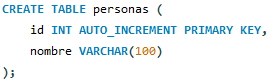
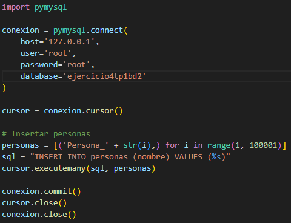
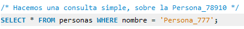
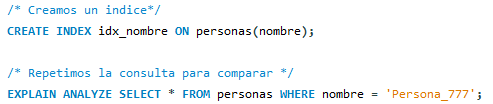

# Base de Datos II

## Tema general: Fundamentos, Integridad y Concurrencia

---

## Ejercicio 1: Reglas de Integridad

### Enunciado
Dado un modelo de base de datos de una universidad, identificar violaciones posibles a la integridad referencial si se elimina un estudiante con cursos inscritos. ¿Qué mecanismos usarías para evitarlo?

### ¿Qué pasa si eliminamos un estudiante?
Si se elimina un estudiante que aún está presente en la tabla de inscripciones, se produce una violación de la integridad referencial. Esto ocurre porque quedarían registros en la tabla **Inscripciones** que hacen referencia a un estudiante que ya no existe, generando inconsistencia en los datos.

### Tablas hipotéticas

**Tablas principales:**
- `Estudiantes` (`id_estudiante`, `nombre`, `edad`)
- `Inscripciones` (`id_estudiante`, `id_curso`, `fecha_inscripción`)

**Relación:**
- `Inscripciones.id_estudiante` es una clave foránea que referencia a `Estudiantes.id_estudiante`.

### Soluciones posibles para mantener la integridad

1. **Restricción al eliminar (ON DELETE RESTRICT):**  
   Impide eliminar al estudiante si tiene inscripciones activas. Es útil cuando se desea conservar toda la información relacionada y evitar inconsistencias.

2. **Eliminación en cascada (ON DELETE CASCADE):**  
   Permite que, al eliminar un estudiante, también se eliminen automáticamente sus inscripciones. Se utiliza cuando las inscripciones no tienen sentido sin el estudiante correspondiente.

---

## 2. Integridad Referencial: Restricción ON DELETE

**Objetivo:**  
Evitar errores o comportamientos no deseados al eliminar registros que tienen dependencias en otras tablas.

**Contexto:**  
Dada una base con estudiantes e inscripciones, al eliminar un estudiante se pueden generar problemas si tiene inscripciones asociadas.

### Soluciones propuestas:

- **ON DELETE RESTRICT:**  
  Impide eliminar un estudiante si tiene inscripciones activas.

  ```sql
  FOREIGN KEY (id_estudiante) REFERENCES Estudiante(id_estudiante) ON DELETE RESTRICT
  ```

- **ON DELETE CASCADE:**  
  Permite eliminar un estudiante y borra automáticamente sus inscripciones.

  ```sql
  FOREIGN KEY (id_estudiante) REFERENCES Estudiante(id_estudiante) ON DELETE CASCADE
  ```

### Conclusión:
La integridad referencial se puede mantener según las necesidades del sistema. Se puede restringir o permitir la eliminación en cascada dependiendo del modelo de negocio.

---

## 3. Concurrencia

## Enunciado
Simular una situación donde dos usuarios intentan actualizar el mismo saldo de una cuenta bancaria. Analizar cómo afectan las condiciones de aislamiento (READ COMMITTED vs SERIALIZABLE).

## Explicación
Para este ejercicio, creamos una tabla llamada cuentas con los campos id_cuenta, nombre y saldo. Luego, simulamos dos transacciones que intentan retirar dinero de la misma cuenta al mismo tiempo.

Se probaron dos niveles de aislamiento:

READ COMMITTED: las dos transacciones pueden ver los cambios ya confirmados. Esto puede provocar errores si ambas transacciones leen el mismo saldo inicial antes de que alguna lo actualice.

SERIALIZABLE: MySQL impide que las transacciones interfieran entre sí, forzando que se ejecuten de forma secuencial. Esto garantiza mayor consistencia, aunque puede generar bloqueos si hay muchas operaciones simultáneas.

---

## Ejercicio 4: Plan de Ejecución con y sin Índice (MySQL)

### Enunciado
Comparar el rendimiento de una consulta SQL sobre una tabla con más de 100.000 registros, primero sin índice y luego con índice. Se utiliza `EXPLAIN` para analizar el plan de ejecución.

### 1. Crear la tabla
Se crea una tabla básica con un ID autoincremental y un campo de nombre.



### 2. Insertar 100.000 registros
Se usa un código en Python para insertar 100.000 registros. A cada persona se le asigna un nombre del tipo: `Persona_(suNúmero)`.



### 3. Ejecutar la consulta sin índice
Se realiza una consulta simple sin el uso de índices.



**Tiempo de ejecución:** 0.219 segundos.


### 4. Ejecutar la consulta con índice
Ahora se crea un índice y se ejecuta la misma consulta.



**Tiempo de ejecución:** casi instantáneo.


### Conclusión

Este ejercicio demuestra la importancia del uso de índices en consultas sobre grandes volúmenes de datos. La diferencia en tiempo de ejecución entre la consulta sin índice y la que lo utiliza es significativa.

---

## 5. Plan de Ejecución y Uso de Índices

**Objetivo:**  
Comparar el rendimiento de consultas SQL con y sin índices y analizar el plan de ejecución.

### Observaciones:

- **Sin índice:**  
  Se realiza un escaneo completo de la tabla (`type: ALL`).

- **Índice en `categoria`:**  
  Mejora parcial al usar solo una columna (`type: ref` o `range`).

- **Índice compuesto en `categoria, fecha`:**  
  El mejor resultado. Se usa el índice para ambas columnas del filtro (`type: range`, `key: idx_categoria_fecha`).

###  Conclusión:
Los índices compuestos son ideales cuando las consultas filtran por más de una columna. El orden de las columnas en el índice importa.

---
## Ejercicio 6: Vistas
Enunciado
Crear una vista que resuma las ventas mensuales por producto. Luego, usarla en una consulta que devuelva los 5 productos más vendidos.

## Explicación
Primero se crea una tabla ventas donde se registran los productos vendidos, la cantidad y la fecha. Después, se construye una vista llamada vista_ventas_mensuales que agrupa por producto y mes, sumando las cantidades vendidas. Esta vista permite simplificar consultas futuras.
Finalmente, se hace una consulta sobre la vista para obtener los 5 productos más vendidos en total, usando GROUP BY, SUM() y ORDER BY.

## Conclusión
Este ejercicio sirvió para entender cómo las vistas pueden facilitar el análisis de datos al permitir reutilizar consultas complejas. Además, me mostró cómo organizar y agrupar información de forma más eficiente para obtener reportes útiles, como los productos más vendidos. La vista simplifica mucho las consultas, y hace que el código sea más claro y reutilizable.

---

## Ejercicio 8: Seguridad y Auditoría

Se creó una tabla `Clientes` y una tabla `Clientes_auditoria` para registrar los cambios con triggers de tipo AFTER INSERT, UPDATE y DELETE.

## Ejercicio 9: Backup y Restore

Se realizó un backup completo con `mysqldump`, se borró la tabla `Clientes` y luego se restauró.

---

