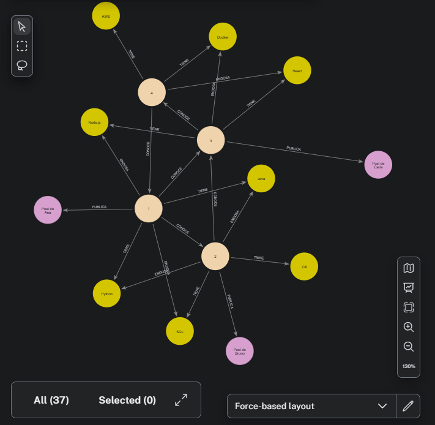
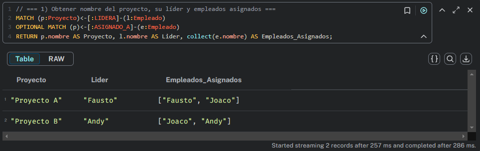
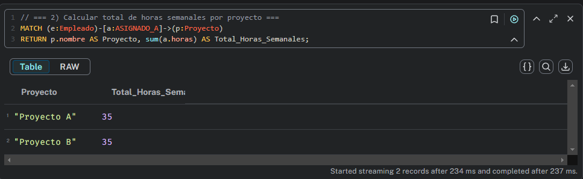
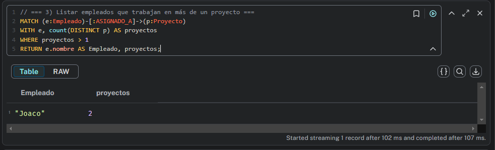
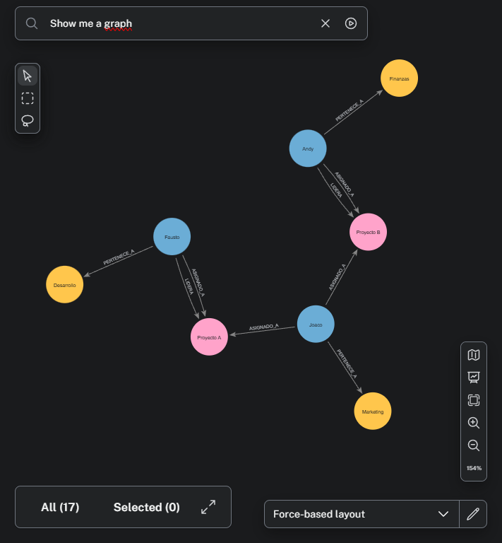

#  TP4: Manejo de Neo4j con Neo4j Desktop 

---

### Para el desarrollo de este trabajo practico, hemos elegido dos de los cuatro puntos disponibles para desarrollar. Los ejercicios elegidos son el 3 y el 1.

### Todo lo hicimos usando **Neo4j Desktop** y vas a ver capturas de pantalla de la misma aplicación para que no se pierda ningún detalle.

---

## 📜 Enunciado — Ejercicio 3: Red Social Profesional

### **Requisitos para armar la red:**

Crear una red donde: 
* Usuarios se conectan con otros usuarios mediante relaciones CONOCE. 
* Los usuarios publican Posts con fecha de publicación. 
* Cada usuario puede tener diferentes Habilidades ,que otros pueden endosar

Insertamos la red con estos datos:

* 4 usuarios con conexiones entre ellos.
* 3 posts de distintos usuarios.
* Al menos 2 habilidades por usuario, con algunos endosos.

### 📄 **Consultas:**

Una vez que tuvimos la red armada, hicimos estas consultas:

* Listar los usuarios con más conexiones ( COUNT ).
* Obtener los 2 usuarios con más publicaciones.
* Mostrar las habilidades más endosadas en total.
* Para un usuario específico, listar las habilidades que aún no ha endosado a otros. 

---

## 1️ Listar usuarios con más conexiones

**Descripción:**  
Muestra todos los usuarios ordenados según la cantidad de conexiones (`CONOCE`) que tienen.

```cypher
MATCH (u:Usuario)-[:CONOCE]->(otro:Usuario)
RETURN u.nombre AS Usuario, COUNT(otro) AS Conexiones
ORDER BY Conexiones DESC
```


---

## 2️⃣ Obtener los 2 usuarios con más publicaciones

**Descripción:**  
Devuelve los dos usuarios con mayor cantidad de publicaciones (Post).

```cypher
MATCH (u:Usuario)-[:PUBLICA]->(p:Post)
RETURN u.nombre AS Usuario, COUNT(p) AS Publicaciones
ORDER BY Publicaciones DESC
LIMIT 2
```


---

## 3️⃣ Mostrar habilidades más endosadas

**Descripción:**  
Lista todas las habilidades y muestra cuántos endosos tienen, de mayor a menor.

```cypher
MATCH (:Usuario)-[:ENDOSA]->(h:Habilidad)
RETURN h.nombre AS Habilidad, COUNT(*) AS Total_Endosos
ORDER BY Total_Endosos DESC
```


---

## 4️⃣ Listar habilidades que un usuario NO ha endosado

**Descripción:**  
Devuelve las habilidades que un usuario específico (por ejemplo Ana) aún no ha endosado.

```cypher
MATCH (h:Habilidad)
WHERE NOT EXISTS {
  MATCH (:Usuario {nombre: "Ana"})-[:ENDOSA]->(h)
}
RETURN h.nombre AS HabilidadesNoEndosadas
ORDER BY h.nombre
```
Nota: Cambiar "Ana" por el nombre del usuario deseado.


---

## Asi quedaria el grafo del ejercicio 3. podemos verlo en Explore y pidiendole que nos muestre el grafico:


---

## 📜 Enunciado — Ejercicio 1: Sistema de Gestión de Proyectos

### **Requisitos para armar el sistema:**

Modelar un Sistema de Gestión de Proyectos que contemple: 
* Cada Empleado pertenece a un Departamento . 
* Los Proyectos pueden tener asignados múltiples empleados con horas semanales. 
* Un empleado puede liderar uno o varios proyectos.

Creamos los siguientes datos:
* Al menos 3 empleados en diferentes departamentos. 
* 2 proyectos. 
* Asignaciones de horas semanales.
* Un líder por proyecto.

### 📄 **Consultas:**

Una vez que tuvimos la red armada, hacemos estas consultas:
* Obtener el nombre del proyecto, su líder y los empleados asignados. 
* Calcular el total de horas semanales por proyecto. 
* Listar los empleados que trabajan en más de un proyecto.

---

---

## 1️ Obtener el nombre del proyecto, su líder y los empleados asignados.

**Descripción:**  
Muestra el nombre del proyecto, su lider y el/los empleados relacionados.

```cypher
MATCH (p:Proyecto)<-[:LIDERA]-(l:Empleado)
OPTIONAL MATCH (p)<-[:ASIGNADO_A]-(e:Empleado)
RETURN p.nombre AS Proyecto, l.nombre AS Lider, collect(e.nombre) AS Empleados_Asignados;
```


---

## 2️⃣ Calcular el total de horas semanales por proyecto.

**Descripción:**  
Muestra el total de horas semanales utilizadas en el proyecto.

```cypher
MATCH (e:Empleado)-[a:ASIGNADO_A]->(p:Proyecto)
RETURN p.nombre AS Proyecto, sum(a.horas) AS Total_Horas_Semanales;
```


---

## 3️⃣ Listar los empleados que trabajan en más de un proyecto.

**Descripción:**  
Muestra los empleados que trabajan en mas de un proyecto.

```cypher
MATCH (e:Empleado)-[:ASIGNADO_A]->(p:Proyecto)
WITH e, count(DISTINCT p) AS proyectos
WHERE proyectos > 1
RETURN e.nombre AS Empleado, proyectos;
```


---

## Asi quedarian el grafo del ejercicio 1, podemos verlo en Explore y pidiendole que nos muestre el grafico:

---