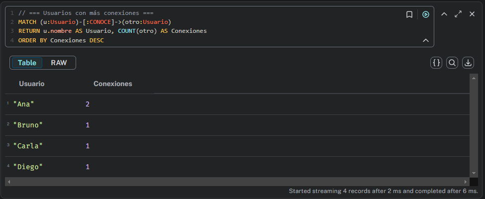
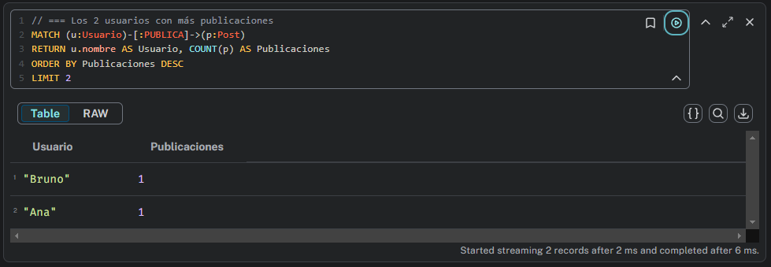
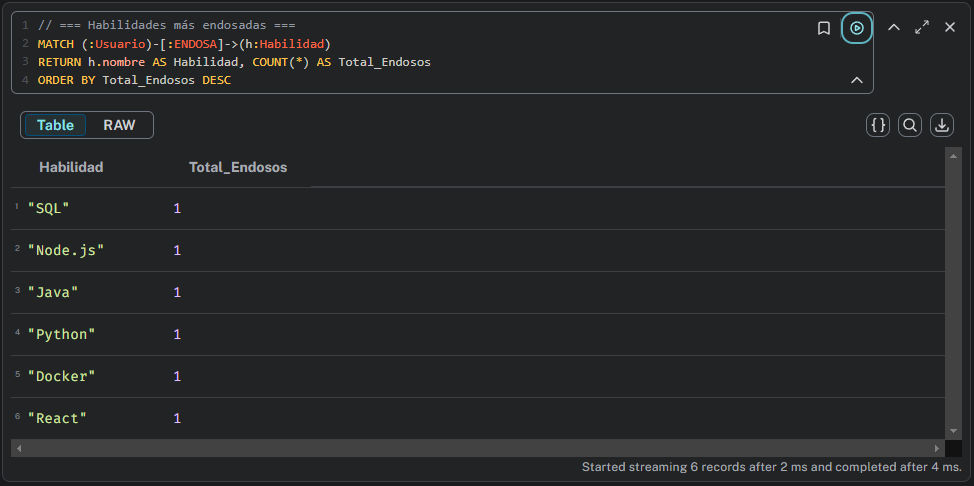
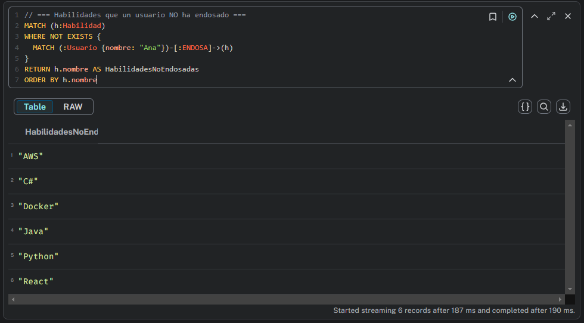
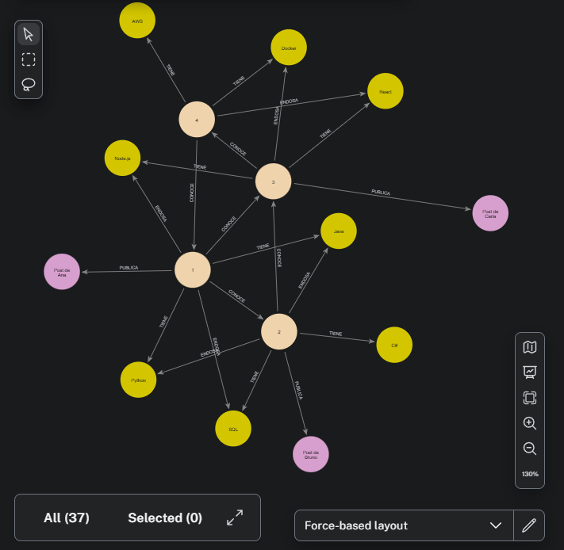

#  TP4: Manejo de Neo4j con Neo4j Desktop 

---

### Para el desarrollo de este trabajo practico, hemos elegido dos de los cuatro puntos disponibles para desarrollar. Los ejercicios elegidos son el 3 y el cuatro.

### Todo lo hicimos usando **Neo4j Desktop** y vas a ver capturas de pantalla de la misma aplicación para que no se pierda ningún detalle.

---

## 📜 Enunciado

### **Requisitos para armar la red:**

Crear una red donde: 
* Usuarios se conectan con otros usuarios mediante relaciones CONOCE. 
* Los usuarios publican Posts con fecha de publicación. 
* Cada usuario puede tener diferentes Habilidades ,que otros pueden endosar

Insertamos la red con estos datos:

* 4 usuarios con conexiones entre ellos.
* 3 posts de distintos usuarios.
* Al menos 2 habilidades por usuario, con algunos endosos.

### **Preguntas al grafo (Consultas):**

Una vez que tuvimos la red armada, hicimos estas consultas:

* Listar los usuarios con más conexiones ( COUNT ).
* Obtener los 2 usuarios con más publicaciones.
* Mostrar las habilidades más endosadas en total.
* Para un usuario específico, listar las habilidades que aún no ha endosado a otros.

# 📄 Consultas — Ejercicio 3: Red Social Profesional

Este documento describe las **consultas Cypher** utilizadas para analizar la red social profesional creada en Neo4j.

---

## 1️ Listar usuarios con más conexiones

**Descripción:**  
Muestra todos los usuarios ordenados según la cantidad de conexiones (`CONOCE`) que tienen.

```cypher
MATCH (u:Usuario)-[:CONOCE]->(otro:Usuario)
RETURN u.nombre AS Usuario, COUNT(otro) AS Conexiones
ORDER BY Conexiones DESC
```



---

## 2️⃣ Obtener los 2 usuarios con más publicaciones

**Descripción:**  
Devuelve los dos usuarios con mayor cantidad de publicaciones (Post).

```cypher
MATCH (u:Usuario)-[:PUBLICA]->(p:Post)
RETURN u.nombre AS Usuario, COUNT(p) AS Publicaciones
ORDER BY Publicaciones DESC
LIMIT 2
```



---

## 3️⃣ Mostrar habilidades más endosadas

**Descripción:**  
Lista todas las habilidades y muestra cuántos endosos tienen, de mayor a menor.

```cypher
MATCH (:Usuario)-[:ENDOSA]->(h:Habilidad)
RETURN h.nombre AS Habilidad, COUNT(*) AS Total_Endosos
ORDER BY Total_Endosos DESC
```



---

## 4️⃣ Listar habilidades que un usuario NO ha endosado

**Descripción:**  
Devuelve las habilidades que un usuario específico (por ejemplo Ana) aún no ha endosado.

```cypher
MATCH (h:Habilidad)
WHERE NOT EXISTS {
  MATCH (:Usuario {nombre: "Ana"})-[:ENDOSA]->(h)
}
RETURN h.nombre AS HabilidadesNoEndosadas
ORDER BY h.nombre
```
Nota: Cambiar "Ana" por el nombre del usuario deseado.



---

## Asi quedarian los grafos, podemos verlos en Explore y pidiendole que nos muestre el grafico:
